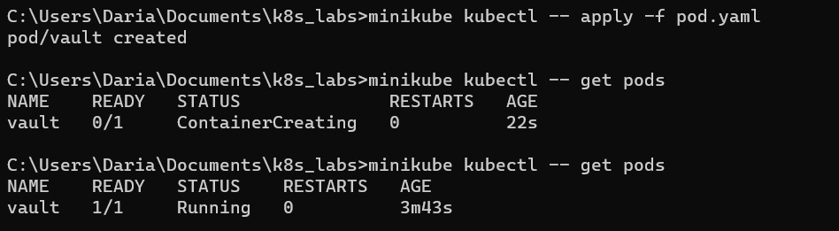
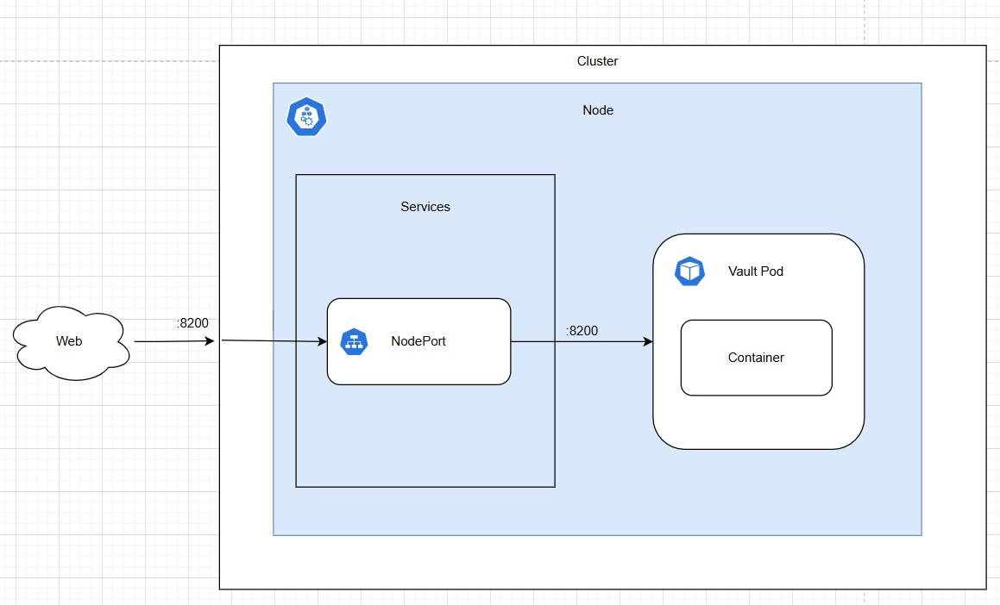

University: [ITMO University](https://itmo.ru/ru/)  
Faculty: [PIN](https://fict.itmo.ru)  
Course: [Introduction to distributed technologies](https://github.com/itmo-ict-faculty/introduction-to-distributed-technologies)  
Year: 2024/2025  
Group: K4110c  
Author: Bortko Daria Victorovna  
Lab: Lab1  
Date of create: 01.12.2024  
Date of finished: -  

## Описание   
Это первая лабораторная работа в которой вы сможете протестировать Docker, установить Minikube и развернуть свой первый "под".  

## Цель работы  
Ознакомиться с инструментами Minikube и Docker, развернуть свой первый "под".  

## Ход работы  
#### Установка Docker Desktop  
Для работы с Docker Desktop необходимо включить виртуализацию на устройстве (эсли этого не было сделано ранее), для этого можно использовать:  
- Панель управления -> Включение или отключение компонентов Windows;  
- Командную строку (PowerShell) с правами администратора;  
- В худшем случае придется внести некоторые изменения в BIOS;  
- ~~В самом плохом - придется переставить windows с нормальным, а не порезанным образом~~  
- ~~А затем вручную ставить пре-релиз версию wsl, ибо иначе не работает~~  

Установщик для Docker берем, разумеется, с официального сайта. Проверяем, что установка прошла успешно, запуская контейнер с традиционным "hello-world" образом.  

#### Развертывание minicume cluster  

Следуем инструкции и за пару команд устанавливаем minikube, разворачиваем minikube cluster. Если ранее уже была предпринята попытка развертывания кластера, будет необходимо его удалить командой minikube delete. Также может потребоваться в явном виде указать драйвер виртуальной машины, который мы хотим использовать при развертывании. Пример команды: _minikube start --vm-driver=docker_. Результат запуска на скриншоте ниже:  

 

kubectl отдельно устанавливать не будем, ограничимся уже имеющимся minikube kubectl.  

#### Развертывание пода HashiCorp Vault

Теперь напишем манифест для развертывание пода с полученным образом. За основу возьмем шаблон манифеста из документации k8s, немного изменим его под свои исходные данные. С помощью написанного .yaml файла мы можем создать "под" с необходимой конфигурацией. Для создания используем команду _minikube kubectl -- apply -f <path_to_yaml>_. Результат создания "пода" представлен ниже:  

Теперь можем создать сервис для доступа к "поду":  

Прокидываем порт 8200 нашего компьютера в контейнер и успешно получаем доступ к авторизации в хранилище:  

Чтобы попасть в секретохранилку, нам нужен токен. Поскольку это первый наш вход в неё, достаточно корневого токена, находящегося на самом видном месте в логах запущенного ранее пода. Вводим найденный корневой токен в форму авторизации и успешно попадаем внутрь:

  

При работе с подом был включен dev режим, так что секретохранилка запустилась сразу в распечатанном виде, в логах отобразились unseal-токен и корневой токен, который можно было сразу же использовать. В реальной практике нужно было бы провести инициализацию хранилища при запуске пода, получить recovery-ключи и затем распечатать (unseal) хранилище с использованием одного из этих ключей. Только после этого у нас появилась бы возможность зайти в хранилище с ипользованием корневого токена. 

#### Ответы на вопросы  
1. Что сейчас произошло и что сделали команды указанные ранее?  
Произошла магия.  
Использованные команды:
_minikube start --vm-driver=docker_  
_minikube kubectl -- apply -f <path_to_yaml>_
_minikube kubectl -- expose pod vault --type=NodePort --port=8200_
_minikube kubectl -- port-forward service/vault 8200:8200_
_minikube kubectl -- logs vault_
_minikube stop_

2. Где взять токен для входа в Vault?  
Как уже было упомянуто, токен лежит в логах запущенного пода vault  

3. Схема организации контейнеров и сервисов 
  
