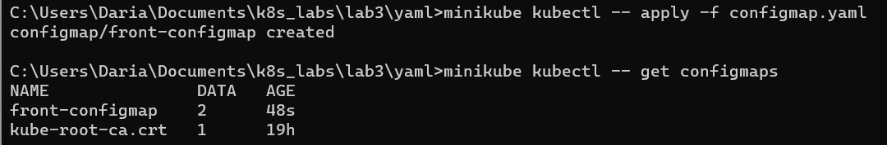
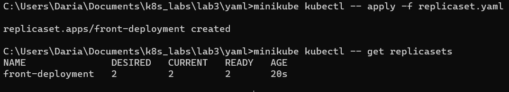
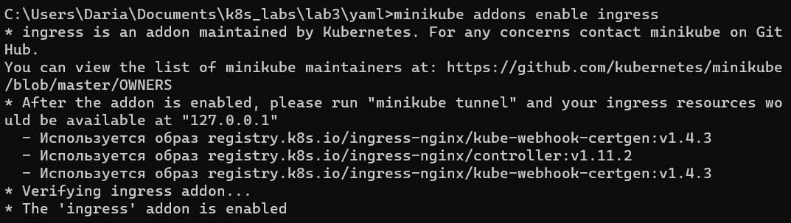
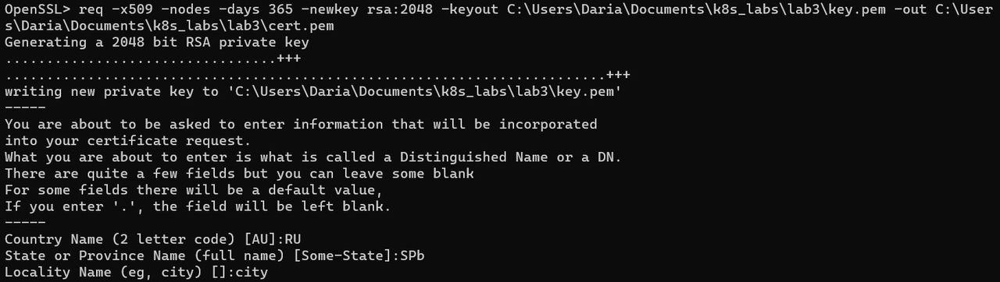
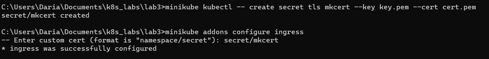
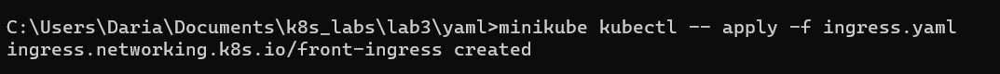
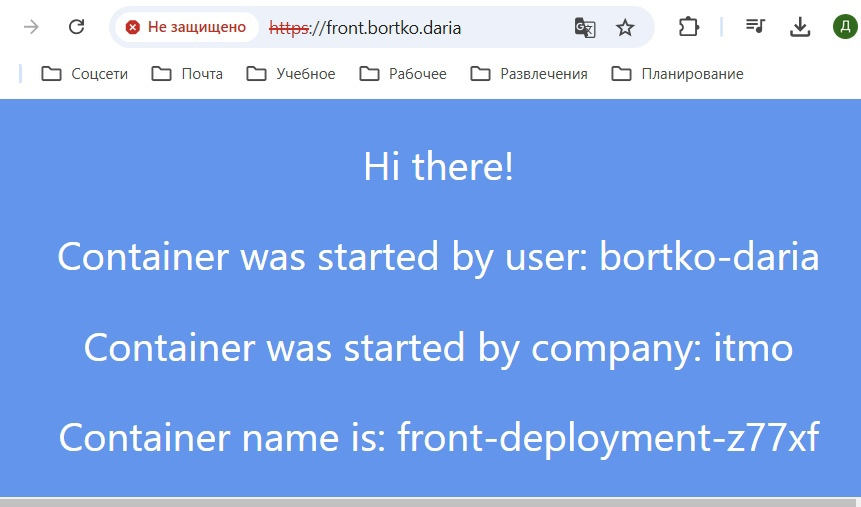
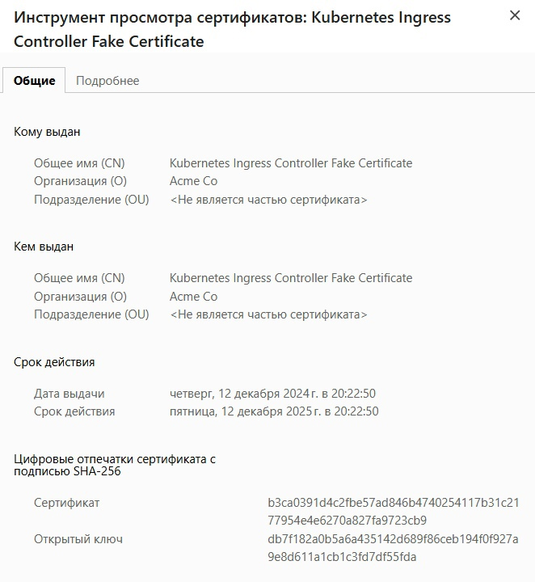
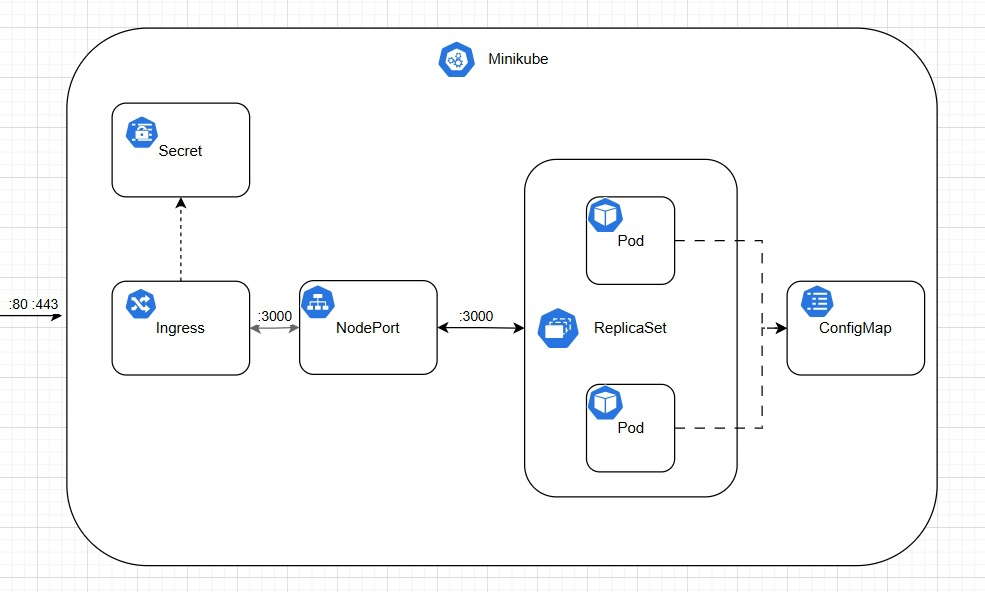

University: [ITMO University](https://itmo.ru/ru/)  
Faculty: [PIN](https://fict.itmo.ru)  
Course: [Introduction to distributed technologies](https://github.com/itmo-ict-faculty/introduction-to-distributed-technologies)  
Year: 2024/2025  
Group: K4110c  
Author: Bortko Daria Victorovna  
Lab: Lab3  
Date of create: 12.12.2024  
Date of finished: -  

## Описание   
В данной лабораторной работе вы познакомитесь с сертификатами и "секретами" в Minikube, правилами безопасного хранения данных в Minikube.  

## Цель работы  
Познакомиться с сертификатами и "секретами" в Minikube, правилами безопасного хранения данных в Minikube.  

## Ход работы 

configMap - это объект Kubernetes, который используется для хранения неконфиденциальных данных конфигурации в виде пар «ключ — значение». Используется для создания конфигурационных файлов или любых других не пустых файлов, а также для определения большого количества переменных среды окружения контейнера. Манифест для создания configMap запишем в yaml файле, создадим соответствующий объект, чтобы использовать его в дальнейшем.  

```
apiVersion: v1
kind: ConfigMap
metadata:
  name: front-configmap
data:
  REACT_APP_USERNAME: "Bortko Daria"
  REACT_APP_COMPANY_NAME: "ITMO"
```

  

Созданный конфиг монтируем в манифест для создания ReplicaSet в качестве источника переменных окружения, создаем соответствующий объект.  

```
kind: ReplicaSet
apiVersion: apps/v1
metadata:
  name: front-deployment
spec:
  replicas: 2
  selector:
    matchLabels:
      app: front-app
  template:
    metadata:
      labels:
        app: front-app
    spec:
      containers:
      - name: front-container
        image:  ifilyaninitmo/itdt-contained-frontend:master
        resources:
          limits:
            memory: "256Mi"
            cpu: "500m"
        envFrom:
        - configMapRef:
            name: front-configmap
        ports:
        - containerPort: 3000
```

  

Для создания сервиса используем тот же манифест, что и в предыдущей лабораторной работе.  

Чтобы получить возможность в дальнейшем использовать Ingress, включаем соответствующее дополнение командой _minikube addons enable ingress_ - это развернет необходимые компоненты для контроллера.  

Ingress — это объект API, который обеспечивает маршрутизацию HTTP и HTTPS к сервисам на основе правил, определённых пользователем. Он функции балансировщика нагрузки и обратного прокси в кластере.  

  

С помощью утилиты openssl сгенерируем TLS сертификат, который затем импортируем в minikube.  

  

Флаг -x509 указывает, что сертификат является самоподписанным, флаг -newkey отвечает за автоматическую генерацию нового ключа, флаг -days говорит о том, что сертификат действует в течение 365 дней.  

  

```
apiVersion: networking.k8s.io/v1
kind: Ingress
metadata:
  name: front-ingress
spec:
  tls:
    - secretName: mkcert
  rules:
  - host: front.bortko.daria
    http:
      paths:
      - path: "/"
        pathType: Prefix
        backend:
          service:
            name: front-service
            port:
              number: 80
```

Создадим объект Ingress с использованием представленного выше манифеста, внесем необходимые изменения в файл hosts (работа выполняется на устройстве под Windows). 
   
  

Внесем в файл hosts информацию о нашем доменном имени и запустим команду _minikube tunnel_, чтобы получить доступ к ресурсу извне. Для корректной работы системы пришлось дополнительно обновить OpenSSH до более новой версии.  

  

  

  


 

